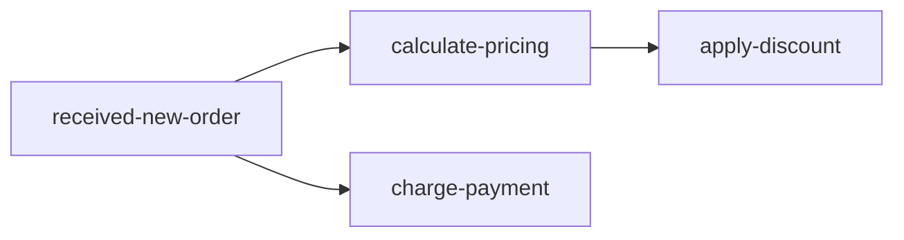

<div align="center">

# @sharetech-labs/logtree

**Structured decision tracing with nested log trees for Node.js + TypeScript.**

Capture execution paths once, then export them as JSON, flat events, ASCII trees, or Mermaid diagrams.

[](https://www.npmjs.com/package/@sharetech-labs/logtree)
[](https://github.com/sharetech-labs/logtree/actions/workflows/ci.yml)
[](https://github.com/sharetech-labs/logtree/actions/workflows/publish.yml)
[](https://opensource.org/licenses/MIT)
[](https://nodejs.org/)

</div>

## Install

```bash
npm install @sharetech-labs/logtree
```

## Quick Start

```ts
import { Trace } from '@sharetech-labs/logtree';

const $order = new Trace('received-new-order', { orderId: 'ORD-4821' });

const $pricing = $order.log('calculate-pricing', { subtotal: 284.97 });
$pricing.log('apply-discount', { code: 'SAVE20', saved: 56.99 });
$order.log('charge-payment', { amount: 227.98, method: 'card' });

console.log($order.summary());
```

Output:

```text
received-new-order
├─ calculate-pricing (subtotal=284.97)
│  └─ apply-discount (code=SAVE20, saved=56.99)
└─ charge-payment (amount=227.98, method=card)
```

## npm + GitHub Friendly Outputs

### Nested JSON (`toJSON`)

```ts
const json = $order.toJSON();
```

Good for API responses, snapshots, or writing trace artifacts in CI.

### Flat Events (`flat`)

```ts
const events = $order.flat();
```

Good for analytics/event pipelines where each entry needs an `id`, `timestamp`, and `_depth`.

### Mermaid Diagrams (`mermaid`)

```ts
const diagram = $order.mermaid();
console.log(diagram);
```

Output:



Use this directly in GitHub Markdown docs, issues, and PR descriptions.

## API At A Glance

```ts
new Trace(id: string, data?: Record<string, unknown>, options?: { consoleLogging?: boolean })

$order.log(label: string, data?: Record<string, unknown>): TraceContext
$order.toJSON(): TraceJSON
$order.flat(): FlatEntry[]
$order.summary(): string
$order.mermaid(options?: { direction?: 'TD' | 'LR' | 'BT' | 'RL'; order?: boolean }): string

$order.setConsoleLogging({ enabled: boolean }): Trace

// The returned context from log() supports:
$step.log(label: string, data?: Record<string, unknown>): TraceContext
```

## Module Usage

### ESM

```ts
import { Trace } from '@sharetech-labs/logtree';
```

### CommonJS

```js
const { Trace } = require('@sharetech-labs/logtree');
```

## Development Scripts

```bash
npm run dev            # vitest watch
npm run test           # run tests once
npm run test:coverage  # coverage report
npm run lint           # type check
npm run build          # tsup build
npm run ci             # full CI checks
npm run check-exports  # verify package type exports
```

## Release + Publish

The GitHub `publish` workflow runs on pushes to `main`, performs CI, bumps patch version, tags, and publishes to npm.

## Contributing

1. Fork and create a branch.
2. Run `npm ci`.
3. Add tests in `tests/` for behavior changes.
4. Run `npm run ci` before opening a PR.

## License

MIT © Sharetech Labs
