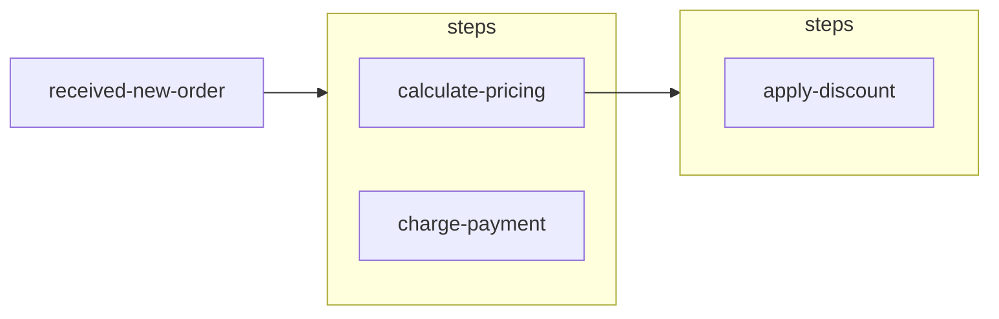

<div align="center">

# @sharetech-labs/logtree

**Structured decision tracing with nested log trees for Node.js + TypeScript.**

Capture execution paths once, then export them as JSON, flat events, ASCII trees, or Mermaid diagrams.

[](https://www.npmjs.com/package/@sharetech-labs/logtree)
[](https://github.com/sharetech-labs/logtree/actions/workflows/ci.yml)
[](https://github.com/sharetech-labs/logtree/actions/workflows/publish.yml)
[](https://opensource.org/licenses/MIT)
[](https://nodejs.org/)

</div>

## Install

```bash
npm install @sharetech-labs/logtree
```

## Quick Start

```ts
import { Trace } from '@sharetech-labs/logtree';

const $order = new Trace('received-new-order', { orderId: 'ORD-4821' });

const $pricing = $order.log('calculate-pricing', { subtotal: 284.97 });
$pricing.log('apply-discount', { code: 'SAVE20', saved: 56.99 });
$order.log('charge-payment', { amount: 227.98, method: 'card' });

console.log($order.summary());
```

Output:

```text
received-new-order
├─ calculate-pricing (subtotal=284.97)
│  └─ apply-discount (code=SAVE20, saved=56.99)
└─ charge-payment (amount=227.98, method=card)
```

## npm + GitHub Friendly Outputs

### Nested JSON (`toJSON`)

```ts
const json = $order.toJSON();
```

Good for API responses, snapshots, or writing trace artifacts in CI.

### Flat Events (`flat`)

```ts
const events = $order.flat();
```

Good for analytics/event pipelines where each entry needs an `id`, `timestamp`, and `_depth`.

### Mermaid Diagrams (`mermaid`)

```ts
const diagram = $order.mermaid();
console.log(diagram);
```

Output:



Use this directly in GitHub Markdown docs, issues, and PR descriptions.

## API At A Glance

```ts
new Trace(id: string, data?: Record<string, unknown>, options?: { consoleLogging?: boolean })

$order.log(label: string, data?: Record<string, unknown>): TraceContext
$order.toJSON(): TraceJSON
$order.flat(): FlatEntry[]
$order.summary(): string
$order.mermaid(options?: { direction?: 'TD' | 'LR' | 'BT' | 'RL'; order?: boolean }): string

$order.setConsoleLogging({ enabled: boolean }): Trace

// The returned context from log() supports:
$step.log(label: string, data?: Record<string, unknown>): TraceContext
```

## Think in Trees, Not Log Lines

Traditional logging is flat — a stream of `console.log` calls. `logtree` is different: every `.log()` call returns a child context, and that return value is the whole point. Capturing it is how you build a tree. Ignoring it is how you record a leaf.

### The return value is the API

```ts
// Ignoring the return value → leaf (terminal fact, no children)
$trace.log('CONFIG_LOADED', { region: 'us-east' });

// Capturing the return value → scope (a phase that will contain sub-steps)
const $pricing = $trace.log('PRICING');
$pricing.log('DISCOUNT_APPLIED', { saved: 12.00 });
$pricing.log('RESULT', { total: 88.00 });
```

If you never capture return values, you're back to flat logging and the library isn't doing anything for you.

### Callers create scopes, callees log into them

Functions should accept a `TraceContext` and log into whatever scope they're given. The **caller** decides where the work nests in the tree — the function doesn't need to know.

```ts
import type { TraceContext } from '@sharetech-labs/logtree';

function resolveEntry(db: DB, input: Input, $trace: TraceContext) {
  $trace.log('SEARCHED', { candidates: 50, query: input.code });
  $trace.log('MATCH', { entryId: winner.id });
}

// Caller decides where it nests
const $resolution = $trace.log('RESOLUTION');
resolveEntry(db, input, $resolution);
```

This keeps functions composable — the same function produces the same trace nodes regardless of where it's called from.

### The tree gives you naming context for free

A label's meaning comes from its position. Deep inside a scope, short names like `RESULT` or `MATCH` are clear because the parent provides context. At the root, labels need to be self-describing.

```text
CLAIM
├─ CONFIG_LOADED          ← root-level: self-describing
├─ RESOLUTION             ← scope label: names the phase
│  ├─ SEARCHED            ← short: parent says what was searched
│  └─ MATCH               ← short: parent says what matched
├─ PRICING
│  └─ LINE (code=99213)
│     └─ RESULT           ← "RESULT" is clear inside PRICING > LINE
└─ CLAIM_RESULT           ← root-level: self-describing
```

### Prefix convention

A `$` prefix on trace variables (e.g. `$trace`, `$step`, `$line`) visually distinguishes trace contexts from business data. This is optional but helps readability, especially when traces are threaded through many functions.

## Module Usage

### ESM

```ts
import { Trace } from '@sharetech-labs/logtree';
```

### CommonJS

```js
const { Trace } = require('@sharetech-labs/logtree');
```

## Development Scripts

```bash
npm run dev            # vitest watch
npm run test           # run tests once
npm run test:coverage  # coverage report
npm run lint           # type check
npm run build          # tsup build
npm run ci             # build package
npm run check-exports  # verify package type exports
```

## Contributing

1. Fork and create a branch.
2. Run `npm ci`.
3. Add tests in `tests/` for behavior changes.
4. Run `npm run ci` before opening a PR.

## License

MIT © Sharetech Labs
